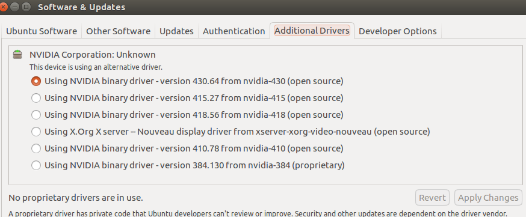
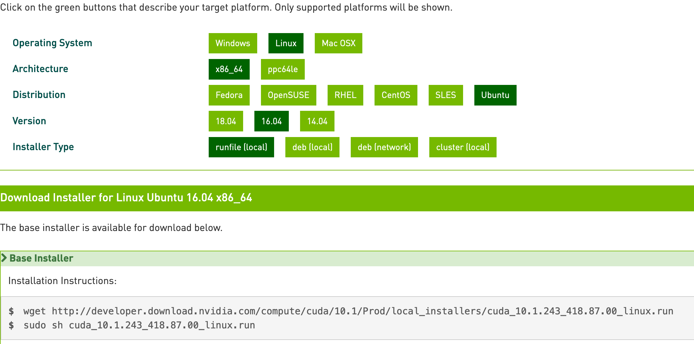
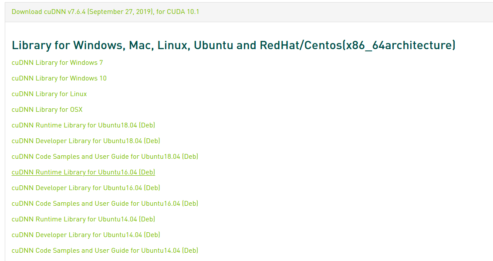

## Set up VNC on Ubuntu

* use 16.04, 18.04 can not offer vnc starting on boot!

#### Step 1: install vnc on ubuntu

```bash
sudo apt-get install x11vnc
```

#### Step 2: setup login password and save it on ubuntu

```bash
x11vnc -storepasswd
```
* By default the passwd is stored at `/home/jacob/.vnc/passwd`.
* By root rule, `sudo su`, it is stored at `/root/.vnc/passwd`.

#### Step 3: check the ip address of ubuntu

```bash
ip addr show
```

#### Step 4: start service

```bash
x11vnc -usepw
```
* the default port number is `5900`

#### Step 5: run vnc on boot

set it as systemctl serive and run it on boot.
```bash
sudo touch /lib/systemd/system/x11vnc.service
cat > /lib/systemd/system/x11vnc.service << EOF
[Unit]
Description=Start x11vnc at startup.
After=multi-user.target

[Service]
Type=simple
ExecStart=/usr/bin/x11vnc -auth guess -forever -loop -noxdamage -repeat -rfbauth /etc/x11vnc.pass -rfbport 5900 -shared

[Install]
WantedBy=multi-user.target
EOF
sudo systemctl enable x11vnc.service
sudo systemctl daemon-reload
```
to check the status
```bash
sudo systemctl status x11vnc
```

#### All in One

1. create a bash file as below, named `vnc-setup.sh`
```bash
# Step 1 - Install X11VNC 
sudo apt-get install x11vnc -y

# Step 2 - Specify Password to be used for VNC Connection 
sudo x11vnc -storepasswd /etc/x11vnc.pass

# Step 3 - Create the Service Unit File
sudo touch /lib/systemd/system/x11vnc.service
cat > /lib/systemd/system/x11vnc.service << EOF
[Unit]
Description=Start x11vnc at startup.
After=multi-user.target

[Service]
Type=simple
ExecStart=/usr/bin/x11vnc -auth guess -forever -loop -noxdamage -repeat -rfbauth /etc/x11vnc.pass -rfbport 5900 -shared

[Install]
WantedBy=multi-user.target
EOF

# Step 4 -Configure the Service 
echo "Configure Services"
sudo systemctl enable x11vnc.service
sudo systemctl daemon-reload

sleep 10

# Step 5 - Restart System 
sudo shutdown -r now
```
2. give permission `sudo chmod +x vnc-setup.sh`
3. run it `sudo ./vnc-setup.sh`

---

## Run a Script on Boot

#### Step 1: create `rc.local`

```bash
sudo vi /etc/rc.local
```

#### Step 2: write commmands

```bash
#!/bin/sh -e
nohup /home/ubuntu/miniconda3/bin/jupyter notebook --allow-root --notebook-dir=/home/ubuntu
exit 0
```

#### Step 3: give permission 

```bash
sudo chmod +x /etc/rc.local
```

#### Step 4: test

```bash
sudo /etc/rc.local start
```

---


## Setup Ubuntu 16.04 with CUDA, GPU

#### Step 1: install required libraries

```bash
sudo apt-get update
sudo apt-get -y upgrade
sudo apt-get install -y build-essential cmake git unzip pkg-config
sudo apt-get install -y libjpeg-dev libtiff5-dev libjasper-dev libpng12-dev
sudo apt-get install -y libavcodec-dev libavformat-dev libswscale-dev libv4l-dev
sudo apt-get install -y libxvidcore-dev libx264-dev
sudo apt-get install -y libgtk-3-dev
sudo apt-get install -y libhdf5-serial-dev graphviz
sudo apt-get install -y libopenblas-dev libatlas-base-dev gfortran
sudo apt-get install -y ppython3-tk python-imaging-tk
sudo apt-get install -y python3-dev
sudo apt-get install -y linux-image-generic linux-image-extra-virtual
sudo apt-get install -y linux-source linux-headers-generic
```

#### Step 2: install Nvidia Drivers for the GPU

- Check the compatibility

    ```bash
    sudo ubuntu-drivers devices
    ```
    [https://docs.nvidia.com/deploy/cuda-compatibility/index.html](https://docs.nvidia.com/deploy/cuda-compatibility/index.html)

- Install lastest nvidia driver

    ```bash
    sudo add-apt-repository ppa:graphics-drivers/ppa
    sudo apt-get update
    sudo ubuntu-drivers devices
    # above will show the suggested driver
    sudo apt-get install nvidia-418
    ```

- Choose the driver

    Go to `Additional Drivers` and select the NVIDIA binary driver. Click on `Apply Changes`.

    

- Confirm nvidia is using

    ```bash
    sudo lshw -c display
    ```

- Check which version of nvidia driver

    ```bash
    nvidia-smi
    ```

    if output is `Failed to initialize NVML: Driver/library version mismatch` and lock in the login page after reboot, just reinstall it and and pick the correct one in `Additional Drivers` , then reboot. 

#### Step 3: blacklist nouveau

Do this to avoid being locked in login page.

```bash
# the first one may be enough
$ sudo vi /etc/modprobe.d/blacklist-nouveau.conf 
$ sudo vi /etc/modprobe.d/blacklist.conf
# write in
blacklist nouveau
blacklist lbm-nouveau
options nouveau modeset=0
alias nouveau off
alias lbm-nouveau off
```

#### Step 4: install cuda

- Download the CUDA Toolkit 10.1 from the following download page: [https://developer.nvidia.com/cuda-toolkit-archive](https://developer.nvidia.com/cuda-toolkit-archive)

    Make selections as indicated in this screenshot, and download the Base Installer.

    

- Hit `Ctrl`+`Alt`+`F1`, got to tty page (`Ctrl`+`Alt`+`F7` is normal display)

    ```bash
    # kill X server session by 
    sudo service lightdm stop
    # Enter runlevel 3 by 
    sudo init 3
    # Install your *.run file.
    sudo sh ./your-nvidia-file.run
    ```

- Reboot and Add paths

    ```bash
    $ sudo vi ~/.bashrc
    export PATH=/usr/local/cuda-10.1/bin:$PATH
    export LD_LIBRARY_PATH=/usr/local/cuda-10.1/lib64
    $ source ~/.bashrc
    ```

- Check if installation succeed (expecting `Result = PASS`)

    ```
    cd /usr/local/cuda-10.1/samples/1_Utilities/deviceQuery
    sudo make
    ./deviceQuery
    ```

#### Step 5: install CuDNN

- Download from [https://developer.nvidia.com/rdp/cudnn-archive](https://developer.nvidia.com/rdp/cudnn-archive)

    

- Install by
    ```bash
    sudp apt install ./name.deb
    ```

#### Reference
- Guides:
  - https://medium.com/@kapilvarshney/how-to-setup-ubuntu-16-04-with-cuda-gpu-and-other-requirements-for-deep-learning-f547db75f227
- install cuda:
  - https://askubuntu.com/questions/149206/how-to-install-nvidia-run
- stuck at login screen:
  - https://superuser.com/questions/1407694/ubuntu-works-without-nvidia-but-stuck-at-login-screen-with-nvidia
  - https://askubuntu.com/questions/481414/install-nvidia-driver-instead-of-nouveau

---

## Ubuntu issues

### Ethernet not recognized

#### Step 1: check the network

```bash
sudo lshw -C network
```

Check if there is `*-network UNCLAIMED`

#### Step 2: modprobe

if using `RTL8111/8168/8411`

```bash
sudo modprobe r8169
```

#### Step 3: uninstall 

You have blacklisted the r8169 module by installing r8168-dkms.

This can be fixed by [link](https://askubuntu.com/questions/777744/need-to-probe-r8169-after-booting)

```bash
sudo apt-get purge r8168-dkms
sudo rm /etc/modprobe.d/r8168-dkms.conf
```

### USB devices not recognized

#### Step 1: Check usb devices

```bash
lsusb
```

#### Step 2: Reinstall xorg input

This can be fixed by [link](https://askubuntu.com/questions/894210/usb-keyboard-and-mouse-not-working-after-upgrade-of-ubuntu-16-04-to-ubuntu-16-10)

```bash
sudo apt-get install --reinstall xserver-xorg-input-all
```

### System Program Problem Detected In Ubuntu

#### Clean cache report

```bash
sudo rm /var/crash/*
```

#### Permanently get rid of system error pop up in Ubuntu

This can be fixed by [link](https://itsfoss.com/how-to-fix-system-program-problem-detected-ubuntu/)

```bash
$ sudo vi /etc/default/apport &
# set this to 0 to disable apport, or to 1 to enable it
# you can temporarily override this with
# sudo service apport start force_start=1
enabled=0
```

### Ubuntu not boot without a monitor using NVIDIA drivers

#### Step 1: Check the Xorg log

```bash
$ cat /var/log/Xorg.0.log # the current log
$ cat /var/log/Xorg.0.log.old # the last log
```

Check if there is
> [ 595.337] (EE) NVIDIA(0): Failed to assign any connected display devices to X screen 0.
> [ 595.337] (EE) NVIDIA(0): Set AllowEmptyInitialConfiguration if you want the server
> [ 595.337] (EE) NVIDIA(0): to start anyway
> [ 595.337] (EE) NVIDIA(0): Failing initialization of X screen 0

#### Step 2: Generate xorg.conf by nvidia

This can be fixed by [link](https://unix.stackexchange.com/questions/211637/how-do-i-get-x-to-start-without-a-monitor-attached-while-using-nvidia-drivers)

```bash
nvidia-xconfig  --allow-empty-initial-configuration
```

#### Step 3: Check the xorg.conf

The output should be as below:

```bash
$ cat /etc/X11/xorg.conf

# nvidia-xconfig: X configuration file generated by nvidia-xconfig
# nvidia-xconfig:  version 430.64

Section "ServerLayout"
    Identifier     "Layout0"
    Screen      0  "Screen0"
    InputDevice    "Keyboard0" "CoreKeyboard"
    InputDevice    "Mouse0" "CorePointer"
EndSection

Section "Files"
EndSection

Section "InputDevice"
    # generated from default
    Identifier     "Mouse0"
    Driver         "mouse"
    Option         "Protocol" "auto"
    Option         "Device" "/dev/psaux"
    Option         "Emulate3Buttons" "no"
    Option         "ZAxisMapping" "4 5"
EndSection

Section "InputDevice"
    # generated from default
    Identifier     "Keyboard0"
    Driver         "kbd"
EndSection

Section "Monitor"
    Identifier     "Monitor0"
    VendorName     "Unknown"
    ModelName      "Unknown"
    Option         "DPMS"
EndSection

Section "Device"
    Identifier     "Device0"
    Driver         "nvidia"
    VendorName     "NVIDIA Corporation"
EndSection

Section "Screen"
    Identifier     "Screen0"
    Device         "Device0"
    Monitor        "Monitor0"
    DefaultDepth    24
    Option         "AllowEmptyInitialConfiguration" "True"
    SubSection     "Display"
        Depth       24
    EndSubSection
EndSection
```

### Ubuntu change resolution (vnc)

```
xrandr --fb 1366x768
```

### Ubuntu schedule a task

* crontab/rc.local task run as `sudo su` role, be careful about this
* [link](https://help.ubuntu.com/community/CronHowto) to check more usage samples

1. Check Current Directory

python -c "import os;print(os.getcwd())"

2. Crontab operations

- to add: `crontab -e`
- to list: `crontab -l`
- to remove: `crontab -r`
- to check the log: `tail /var/log/syslog`
- to check the status: `sudo service cron status`
